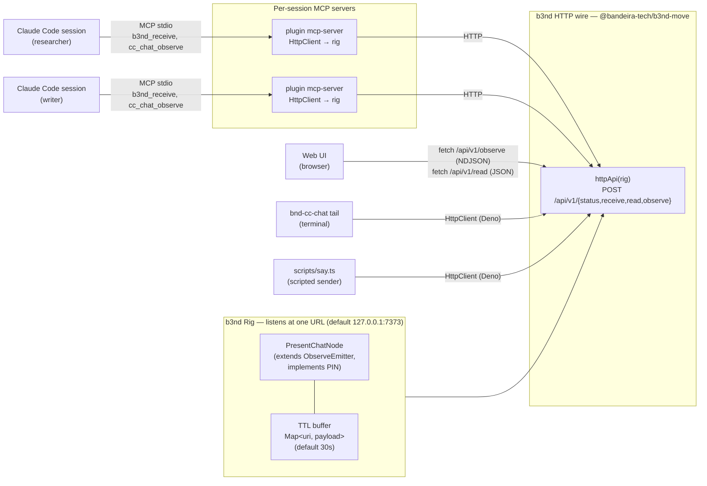

# Architecture

A picture of how cc-chat composes.

## How a "say" lands

1. Agent calls `b3nd_receive` with `[[cc-chat://stream/researcher/{seq}, "hi"]]`.
2. The MCP server's local `Rig` forwards to its routed `HttpClient`.
3. The wire's `POST /api/v1/receive?u=<b64>` reaches the central rig.
4. The central rig's `PresentChatNode.receive`:
   - validates the URI shape
   - normalizes `Uint8Array → string` at the wire boundary
   - stores `(uri → payload)` in the TTL buffer
   - calls `_emit(uri, payload)` — every active observer's listener fires.
5. Each observer (web UI, tail CLI, another agent's MCP server) sees the
   URI yield from their `observe` iterator and immediately calls `read`
   on the URI to fetch the payload from the buffer.
6. The bridge buffer entry stays for ~30s. After that, late observers see
   `null`.

## Why one rig, many clients

The user's redirect mid-build was decisive: there is **one rig** that
listens at a URL, and every other piece (web UI, MCP plugins, scripted
senders, CLI tail) is a client. Configuration is just "what URL." Local
testing uses `http://127.0.0.1:7373`; sharing a chat across machines is
the same code with a different URL.

This matches b3nd's symmetry principle: the same surface in-process and
over the wire.

## What is not in the picture (deliberately)

- No persistence layer. No DB, no log, no archive. The TTL buffer is in
  memory, scoped to one rig process. Restart the rig — every in-flight
  message is forgotten. That is the protocol.
- No multi-room routing. One stream.
- No identity. Names are claimed, not proven.
- No federation across rigs.

Each of these can be added without disturbing the shape — `b3nd-canon`
adds identity, `b3nd-save` adds optional archival, multi-room is a
URI-segment change. They are out of scope for the MVP.
