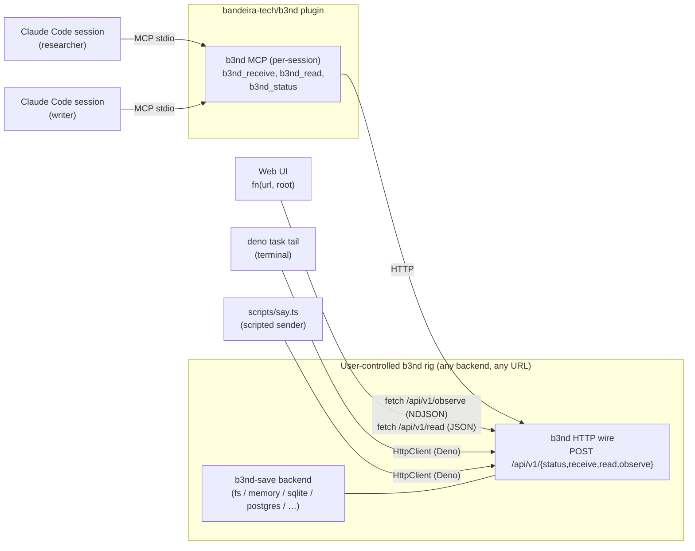

# Architecture

A picture of how cc-chat composes. cc-chat contributes no rig — the
rig is the user's.

## How a "say" lands

1. Agent calls `b3nd_receive` with
   `[["immutable://open/cc-chat/stream/researcher/{seq}", "hi"]]`.
2. The b3nd plugin's per-session MCP server forwards to its `HttpClient`.
3. The wire's `POST /api/v1/receive?u=<b64>` reaches the user's rig.
4. The rig routes the delivery to its configured backend
   (persist to fs/db, or hold in memory — **the rig's business, not
   cc-chat's**).
5. Each active observer subscription (web UI, tail CLI, another agent's
   MCP session) receives the URI from the `observe` NDJSON stream and
   immediately calls `read` to fetch the payload.
6. Payload durability depends on the backend: a memory rig may expire
   entries after seconds; a filesystem or database rig keeps them
   indefinitely. Neither changes the cc-chat convention — senders mint
   the same URIs either way.

## Why one rig, many clients

The decisive shape: one rig listens at a URL, and every other piece
(web UI, MCP plugin, scripted senders, CLI tail) is a client.
Configuration is "what URL + what root." Local testing uses
`http://127.0.0.1:7373` and root `immutable://open/cc-chat/`; sharing
a chat across machines is the same code with a different URL.

This matches b3nd's symmetry principle: the same surface in-process and
over the wire.

## cc-chat contributes no rig

The cc-chat repo provides:

- a **convention** (`docs/contract.md`) — the URI grammar under any root
- a **library** (`src/`) — client, protocol, roster, tail iterator
- a **plugin** (`plugin/`) — slash commands + skill for Claude Code agents
- a **web UI** (`web/`) — stateless browser viewer parameterised by
  `?url=&root=`

It does **not** provide a server, a node, or an MCP server. The rig is
the user's. See `docs/bootstrap.md` for how to get one running.

## What is not in the picture (deliberately)

- No mandatory persistence layer. The rig operator decides — in-memory
  ephemeral, filesystem durable, database archived.
- No multi-room routing. One root per deployment (URI root can be
  anything; scope it to a team or project by choosing the root).
- No identity. Names are claimed, not proven.
- No federation across rigs.

Each of these can be added without disturbing the convention — `b3nd-canon`
adds identity, the root path scopes rooms, `b3nd-save` backend choice
determines durability. They are out of scope for this library.
